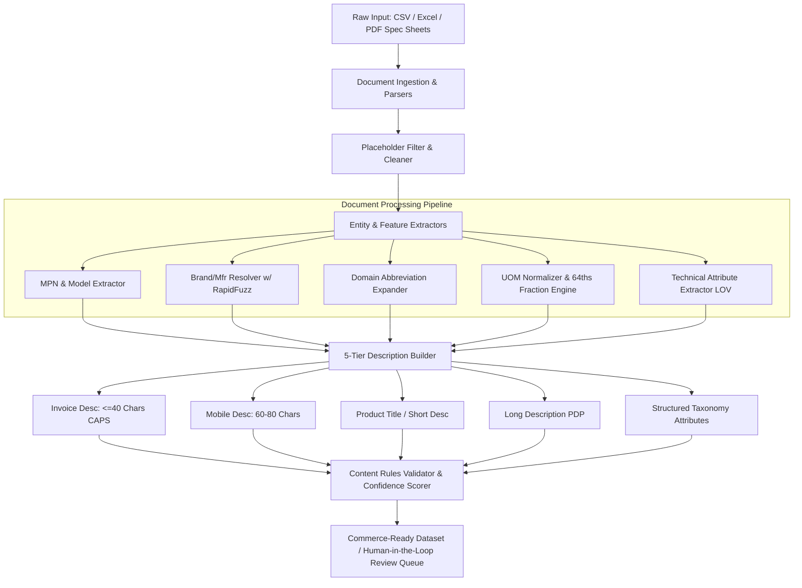

# Architecture: Document Processing Subsystem

## 1. System Overview
The **Document Processing** subsystem is the ingestion and normalization engine of the AI-Powered Industrial Product Intelligence platform. It bridges the gap between unstructured, cryptic distributor spreadsheets/PDF cut-sheets and structured, commerce-ready product data conforming strictly to Unilog internal content standards and controlled vocabularies.

---

## 2. Core Modules & Responsibilities

### A. Ingestion Parsers (`document-processing/parsers/`)
- **`catalog_parser.py`**:
  - Ingests distributor catalogs in CSV, TSV, and `.xlsx`/`.xls` formats.
  - Automatically handles multi-row headers, merged cells, and stray notes.
  - Eliminates placeholders (`-- Unbranded --`, `-- No Unilog Brand --`, `-- No DIB Brand --`, `COMMODITY - UNBRANDED`, `-`, `N/A`).
- **`pdf_parser.py`**:
  - Ingests manufacturer PDF datasheets, cut sheets, and installation manuals.
  - Extracts structural text blocks, detected part numbers, and embedded parameter matrices.
- **`table_parser.py`**:
  - Parses ASCII, pipe-delimited, and tab-delimited specification tables from technical documents.

### B. Extractors & Normalizers (`document-processing/extractors/`)
- **`mpn_extractor.py`**:
  - High-precision extraction of alphanumeric Manufacturer Part Numbers (MPNs) and series codes from noisy strings.
- **`brand_resolver.py`**:
  - Fast fuzzy matching with `rapidfuzz` against canonical master brand/manufacturer registry (`data/canonical_brands.json`).
  - Automatically appends legal casing and registered trademark symbols (`®`, `™`).
- **`uom_normalizer.py`**:
  - Standardizes 89+ measurement types to approved abbreviations with mandatory space (`24 in`, `120 V`, `15 A`).
  - Converts decimal dimensions to 64ths fractions (`50.25 in` $\to$ `50-1/4 in`).
- **`abbreviation_expander.py`**:
  - Context-aware lexicon resolving industrial acronyms (`SS` $\to$ `Stainless Steel`, `Sq` $\to$ `Square`, `Alum` $\to$ `Aluminum`, `Horiz` $\to$ `Horizontal`).
- **`attribute_extractor.py`**:
  - Extracts dimensions, electrical parameters, mechanical specs, materials, colors/finishes, and package counts.

### C. 5-Tier Description Builder (`document-processing/description_builder.py`)
1. **Invoice Description**: $\le 40$ characters, ALL CAPS, high-density technical specs.
2. **Mobile Description**: $60\text{–}80$ characters target, structured for mobile app cards.
3. **Product Title / Short Description**: Brand® + Series + MPN + Item Type + Key Specs.
4. **Long Description**: Rich, grammatically ordered specification sentences for PDPs.
5. **Structured Taxonomy Attributes**: Key-value pairs for eCommerce faceted navigation.

### D. Quality & Compliance Validator (`document-processing/validator.py`)
- Audits generated records against character limits, casing rules, UOM compliance.
- Assigns a granular confidence score ($0\text{–}100\%$).
- Flags items needing Human-in-the-Loop review when confidence is low or required attributes are ambiguous.
