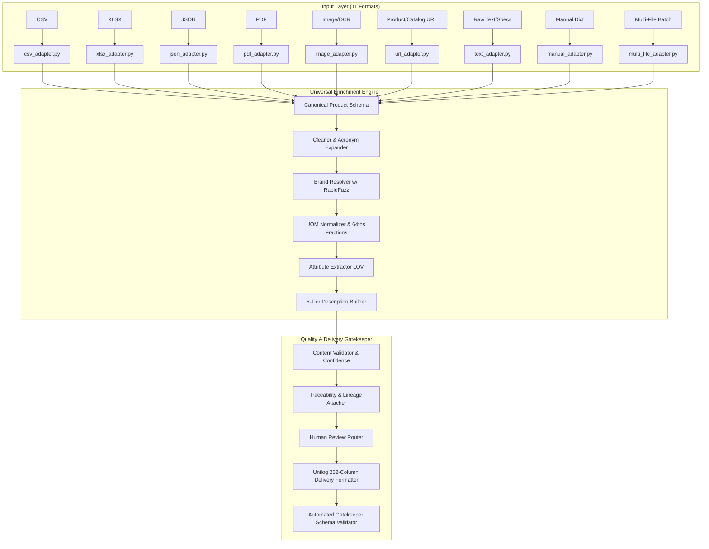

# Implementation Plan: Universal Product Data Processing Pipeline

## 1. Objective & Scope
Build a comprehensive **Universal Product Data Processing Pipeline** that ingests all 11 input types provided by the frontend interface (PDF, CSV, XLSX, JSON, Image/OCR, Product URL, Catalog URL, Manual Entry, Raw Text, Drag & Drop, Multiple Files) and converts them into a single **Common Canonical Product Schema**, processes them through the enrichment engine, and outputs 100% compliant 252-column Unihack commercial delivery format with full traceability.

---

## 2. Architecture & Components

---

## 3. Detailed File Plan

### A. Canonical Schema (`document-processing/canonical_schema.py`)
- `CanonicalProductRecord`: Standard dataclass/dict schema with `source`, `raw_data`, `product`, `normalized`, `generated`, `quality`, `traceability`.
- `SourceMetadata`: Source type, filename, location/sheet/row/page/url, source ID.

### B. Input Adapters Layer (`document-processing/adapters/`)
1. `csv_adapter.py`: Flexible column mapping, encoding auto-detection (`utf-8`, `latin1`, `cp1252`), multi-row headers, row-level provenance.
2. `xlsx_adapter.py`: Multi-sheet inspection, header detection, empty row skipping, sheet + row provenance.
3. `json_adapter.py`: Single item, list of items, nested structures, alias dictionary mapping (`productName`, `item_name`, `part_desc`).
4. `pdf_adapter.py`: Text extraction with PyPDF, page numbers, parameter matrix parsing, scanned PDF detection with OCR fallback flag.
5. `image_adapter.py`: Image format support, visual property extraction, OCR text parsing for label specs.
6. `url_adapter.py`: URL validation, HTTP request with timeout & redirect handling, HTML cleanup, metadata & text extraction, linked PDF detection.
7. `text_adapter.py`: Raw pasted text parser (key-value patterns, product bullet points, unstructured specs).
8. `manual_adapter.py`: Direct dictionary / form input mapping to canonical schema.
9. `multi_file_adapter.py`: Composite processor handling lists of mixed files (`.pdf` + `.xlsx` + `.csv` + `.json` + `.png`) maintaining individual provenance.
10. `__init__.py`: Adapter registry and auto-dispatcher (`get_adapter_for_input`).

### C. Backend Service & Universal Pipeline Integration
- `UniversalDataPipeline` in `document-processing/pipeline.py` exposing:
  - `process_input(input_type, input_data, metadata=None)`
  - `process_batch(inputs)`
  - `process_file(file_path_or_bytes, filename=None, metadata=None)`
  - `process_files(list_of_files)`
  - `process_url(url, metadata=None)`
  - `process_text(raw_text, metadata=None)`
  - `process_manual(product_dict, metadata=None)`
- Expose REST API router in `backend/app/api.py` for frontend integration.

### D. Comprehensive Automated Test Suite (`document-processing/test_adapters.py`)
- Unit and integration tests for every single input adapter.
- Tests for missing fields, invalid files, OCR fallbacks, URL timeouts, and multi-file merges.
- Full verification that `python document-processing/benchmark.py` passes with 1000 items, 252 columns, and exit code 0.
